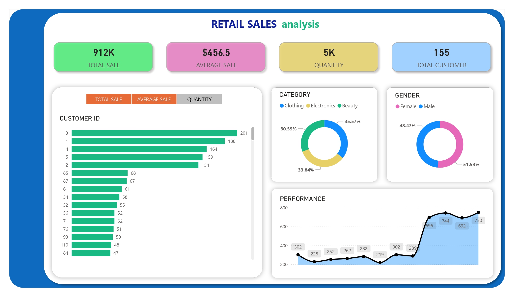
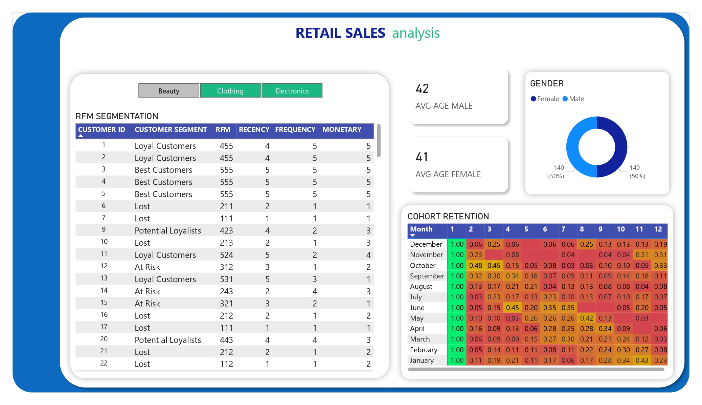

# 🛍️ Retail Sales Analysis (SQL Project)

### 🔎 Dashboard Preview

This project aims to analyze a **Retail Sales** dataset using SQL. The analysis is divided into two main parts: **Exploratory Data Analysis (EDA)** and **Advanced Data Analysis (ADA)**.  

Dataset used: [`SQL - Retail Sales Analysis_utf.csv`](./datasets/SQL%20-%20Retail%20Sales%20Analysis_utf%20.csv)  

---

## 📂 Project Structure
- `EDA.sql` → SQL queries for **Exploratory Data Analysis**  
- `ADA.sql` → SQL queries for **Advanced Data Analysis**  
- `SQL - Retail Sales Analysis_utf.csv` → Retail sales dataset (CSV)  

---

## 🔎 Exploratory Data Analysis (EDA)
EDA focuses on exploring dimensions, date ranges, and key business metrics.  

### 🗂️ Dimension Exploration
- List all available product categories.  

### 📅 Date Exploration
- Identify the first and last transaction date.  
- Find the youngest and oldest customers.  

### 📊 Measure Exploration
- Total number of unique customers.  
- Total sales (revenue).  
- Total number of transactions/orders.  
- Total number of products sold.  
- Revenue generated per customer.  
- Revenue generated per category.  
- Sales and gender distribution per category.  
- Average age of customers per gender and category.  
- Customers making **repeat purchases** (daily, weekly, monthly, yearly).  

### 📑 Business Metrics Report
Generates a summary of the key business metrics:
- Total Sales  
- Total Customers  
- Total Categories  
- Total Products Sold  
- Total Orders  

---

## 🚀 Advanced Data Analysis (ADA)
Advanced analytics are performed to derive deeper insights into customer behavior and profitability.  

### 💰 Profitability Analysis
- Calculates total revenue, COGS, profit margin, margin percentage, and transaction count by product category.  

### 🧩 RFM Segmentation
Customers are segmented based on:  
- **Recency** → How recently a purchase was made  
- **Frequency** → How often purchases were made  
- **Monetary** → Total spending amount  

Customers are scored and classified into segments such as:  
- **Champion**  
- **Loyal**  
- **Potential**  
- **At Risk**  
- **Lost**  
- **Other**  

### 📈 Cohort Retention Analysis
- Groups customers into cohorts based on their first purchase month.  
- Measures monthly customer retention rates (%) over time.  

---

## 🛠️ Tools & Requirements
- **Database**: MySQL / MariaDB  
- **Dataset**: Retail Sales (CSV)  
- **SQL Features Used**:
  - Aggregate Functions (`SUM`, `COUNT`, `AVG`)  
  - Window Functions (`NTILE`)  
  - Common Table Expressions (CTEs)  
  - Date Functions (`DATE_FORMAT`, `WEEK`, `YEAR`)  

---

## 📌 How to Use
1. Import the CSV dataset into your SQL database.  
2. Full queries available in [EDA.sql](./scripts/EDA.sql) and [ADA.sql](./scripts/ADA.sql).
3. Run the queries in `EDA.sql` for exploratory analysis.  
4. Run the queries in `ADA.sql` for advanced analysis. 
 

---

## 📊 Key Insights
- Identification of best-selling product categories.  
- Customer segmentation based on purchasing patterns.  
- Detection of repeat customers and loyalty trends.  
- Profitability assessment across product categories.  
- Customer retention trends through cohort analysis.  

---

## 👤 Author
**Muhamad Irvandi** 
[LinkedIn](https://www.linkedin.com/in/irvandddi/) | [GitHub](https://github.com/irpan06)